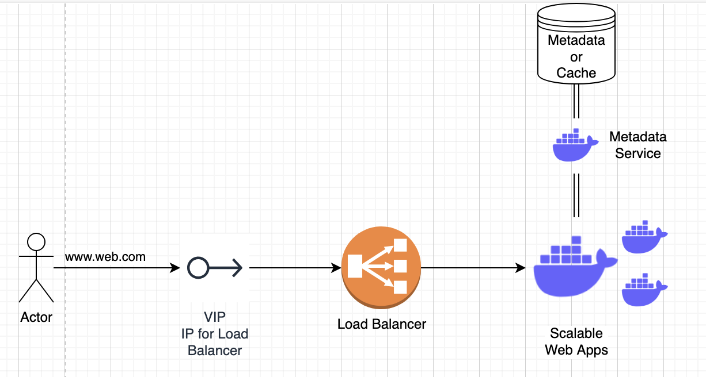

# General Notes
There are some things that are generally true across system design questions

## Functional Requirements
- Scalable: This usually just means it's going to be called a lot, and so we'll need partitions, meaning there are tradeoffs on the Availability-Consistency spectrum we need to choose
    - Almost every system always needs to be scalable, i.e. needs partitions, i.e. has main trade-offs between availability and consistency

### Availability-Consistency Tradeoff
When we know we want a scalable, partitioned system we then need to choose what happens in the worst case (i.e. when there are breaks between the partitions)
    - When our partitions can't talk to each other do we keep the entire system up (Available) even if some of the nodes can't talk to each other (not Consistent)
    - Or do we ensure the system stays in it's last known Consistent state, but can't serve some requests (not Available)

This is generally true, and even if we have partitions up there are still trade-offs between availability and consistency
    - The typical example is read replicas of databases
    - If we have N read replicas, and there's 1 leader and N-1 replicas, do we allow those N-1 to serve reads after the 1 may have gotten a new write?
        - If we do we're choosing highly performant and highly available over strict consistency

***There are ways to handle all of these trade-offs, and the Availability-Consistency spectrum spans a large space that's covered by many database types, isolation levels, and choices - all of them are useful in different scenarios***

### Typical Patterns
Almost every single system a set of similar patterns

#### Front End
- Front end we usually have some sort of DNS resolution to IP address, where the IP address relates to our Load Balancers
- Once it reaches (app) load balancers it will do TLS/SSL termination, decrypt, and forward to either API Gateway, or straight to web apps
    - API Gateways are useful for app load balancers to route requests to based on URL patterns, but that's another story
    - Here we go straight to web apps which will then do:
        - Authentication (client is client)
        - Authorization (client is able)
        - Metadata Lookup (client is what)
            - Metadata service is another microservice that helps us to call the metadata database / cache with info
- Once this is done we have a request along with context to send to backend

