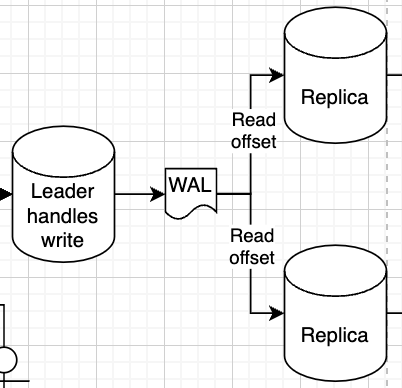

# Replication
Replication is around copying a database on one physical machine to another 

This can be done in so many ways, and each of them has pros and cons

## Snapshots
| Pros       | Cons           |
|------------|----------------|
| Stable     | Slow           |
One of the easiest ways is to just take the flat files that a database uses on disk, and copy those over to another node

We can also "snapshot" that disk at some point in time and copy that over to another physical node

## Logical Replication
| Pros       | Cons           |
|------------|----------------|
| Stable     |                |
| Cheap      |                |
| Available  | Not consistent |
In the Data Engineering world we use WAL's (Write Ahead Logs) and CDC (Change Data Capture) a lot 

WAL's are basically an append only log (on disk) of things done on a database
```
insert (a, 1) at 0:0:0
insert (b, 2) at 0:0:1
insert (a, 2) at 0:1:1
delete (a, 2) at 0:3:1
...
```

WALs solve multiple problems themselves!
    - Fault tolerance since they are written on disk, and after a crash we can replay these logs
    - Replication by having other replicas read this WAL to see what they need to do
    - Logging! We sometimes want to know when transactions / writes happened

Each replica has a replication slot, which is basically just the metadata of the last offset it's read
    - So maybe one replica is currently at the 3rd command `insert (a, 2)`
    - And the other replica is up to date and has done `delete (a, 2)`
    - ***We can see here that the two replica's aren't consistent! A request to either would result in 2 different results***


This type of replication is typically used in the Data Engineering world between replicas to serve requests, to push from an application database to an analytical data warehouse, or to push events from an app database onto an event broker


## Quorum 
| Pros       | Cons           |
|------------|----------------|
|          | Hard to implement|
| Consistent  | Performance / availability hit |
| Fast (rpc vs disk)  |  |
Quorum systems are similar to WAL, but we send the log entries over the network (each insert / update / delete is an RPC call) to all of the replicas, and then they reply when they've successsfully gotten it

[RAFT is a quorum implementation](https://github.com/lsprangers/raft-course/blob/main/README.md)

After enough nodes (usually > 1/2) reply they've gotten it (a quorum) we consider the value replicated
    - This reply from a quorum might take a long time, and that would mean a performance and availability reduction 
        - We can still serve other reads and writes from other clients, but that specific update would not be reflected for a while and that would be annoying as a client

### Leader vs Leaderless
- RAFT and Paxos quorum algorithms have leaders, where one single node accepts all reads and writes and RPC's out to followers
- Other implementations like CochroachDB allow any node to accept reads and writes and then they use the gossip protocol to send out messages 
    - This is much harder to implement, but allows for much higher scaling since it's not a single node bottleneck
    - When a new read request comes in we need to send read to all nodes, and if majority agree on a value then we can consider it the known current value

### Availability vs Consistency
- Some setups allow for the quorum replicas to serve reads, and there are ways to do this to ensure serializabiltiy and consistency
- CockroachDB is one of the groups who implemented this

