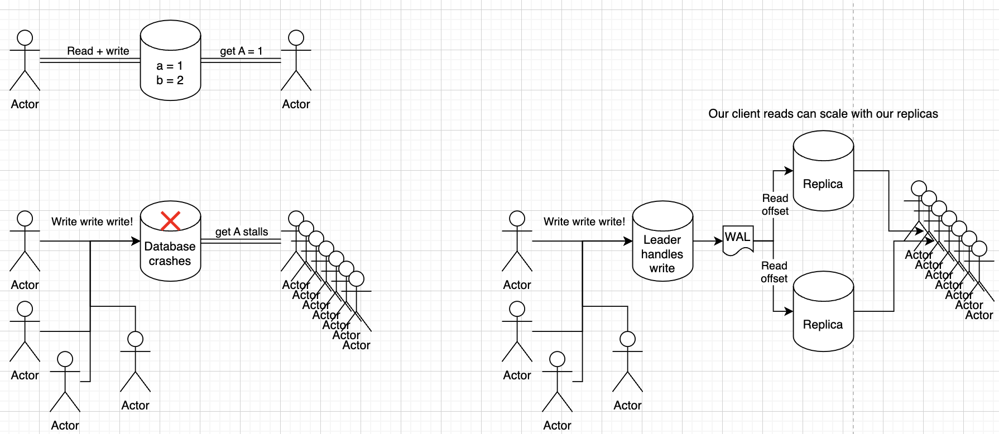

# Key Value Store
Basically an API over a hash map

There are some other things we can do in terms of indexing, sharding, consistency, and replication that causes differences between different systems

## Implementation
In this scenario we chose to create a distributed, sharded KV store with node ranges based on consistent hashing, and replication done via RAFT
- Each "node" in the system is actually a RAFT cluster with one leader and multiple replicas
- The nodes are considered fault tolerant, replicated, and consistent
- The cluster itself can autoscale by placing new nodes in the ring and shuffling to split, or by deleting nodes and shuffling to merge

Code for this is easiest to just view my crappy [RAFT Repo](https://github.com/lsprangers/raft-course/blob/main/README.md) instead of me trying to recreate it heres

## Isolation Levels
Before going into other areas, the [isolation levels](ISOLATION_LEVELS.md) and read/write levels will come back continually throughout the discussion, especially for distributed systems

We know there is always an [Availability and Consistency Tradeoff](../README.md#availability-consistency-during-network-partition) for Partitioned scalable systems, and Databases are one key area where it continually comes up. If I write a value somewhere, how do I ensure other groups reading that value see the same value...

We describe [Isolation Levels](ISOLATION_LEVELS.md) extensively here

## How things got here
Old days:
- Single instance of DB can handle traffic
- Backups for durability
- Single other database for fault tolerance
- Clients interact with same physical data in database...life is easy!

Data grew:
- Especially for social networks
- To increase read throughput they copied data



## Where things are
Most database clusters today are actually clusters of clusters!

Sharding our database into multiple nodes, where each node handles a shard, allows us to split up our data so that it's not sitting on one single machine

Replication of those nodes helps us to scale reads on those nodes, and also to provide fault tolerance


### Scaling
If our database grows too large and is crashing we have 2 options - Horizontal or Vertical Scaling

Vertical scaling equates to "make the compute larger" which reaches limitations very quickly, but for some teams and products this is completely fine and then we can ignore all of the issues that come up with distributed systems!

Horizontal scaling is usually the route taken where we take our database and split it up into subsets

### Sharding
Sharding is useful when we want to have different nodes accept reads and writes for different subsets of our database, and sometimes it's required when our data can't sit on a single machine

```
fake table
----------
1 a b c
2 d e f
3 g h i
```
Sharding can be done horizontally or vertically as well
    - Horizontal sharding is when we split up by rows, so maybe we have `1 a b c` in one node, and `2 d e f` in another
    - Vertical sharding is when we split things up by columns so maybe `a d g` is on one node, and `c f i` in another

### Replication
For each node in a shard (or the single node in a non-sharded database) we can use [Replication](REPLICATION.md) to solve 2 major problems - Fault Tolerance and Scaling 

Fault tolerance is solved by replicating the data onto other nodes, so if the main leader fails then the replica can take over

Scaling can be solved by using those replicas to serve reads

#### Replication and Isolation Levels
Replication is tied heavily into [Isolation Levels](ISOLATION_LEVELS.md) because the way these nodes are able to serve data depends on that isolation level

The below [Replication](REPLICATION.md) implementations are all covered in the supporting document
- Consensus
    - Leader vs Leaderless
- Quourum
- WAL
- Snapshot 