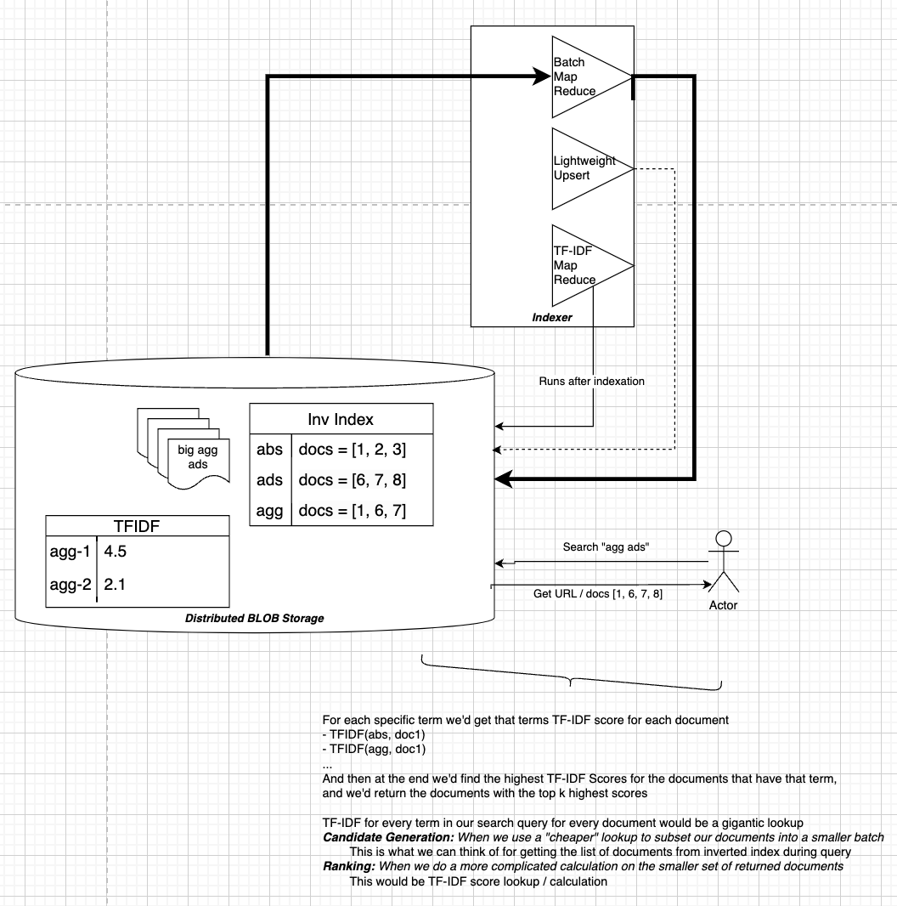

# Table of Contents
- [Search Systems](#search-systems)
- [Inverted Index](#inverted-indexes)
- [Ranking & Comparing](RANKING.md#ranking-first-pass-at)
    - [Count Based Heuristics](RANKING.md#count-based-heuristics)
        - [TDIDF / BM25](RANKING.md#tf-idf--bm25)
    - [Probabilistic Models](RANKING.md#probabilistic-models)
        - [Bayesian Proba](RANKING.md#bayesian-proba)
        - [Learn To Rank](RANKING.md#learn-to-rank)
    - [Graph](RANKING.md#graph)
        - [Page Rank](RANKING.md#page-rank)
    - [Embeddings](RANKING.md#embeddings)
      - [Vector Space Model](RANKING.md#vector-space-model)
      - [Neural Models](RANKING.md#neural-models)
        - [BERT](RANKING.md#bert)
    - [Hybrid Models](RANKING.md#hybrid-models)
- [Context](#context)
    - [Embeddings](#embeddings)
    - [History](#history)
    - [Attention](#attention)
    - [User Embeddings](#user-embeddings)
        - [Collaborative Filtering](#collaborative-filtering)
        - [Matrix Factorization](#matrix-factorization)
- [Real Time Serving Systems](#real-time-serving-systems)
    - [Candidate Generation](#candidate-generation)
    - [Ranking](#ranking)
    - [Serving](#serving)
- [Youtube DNN Paper + Discussion](#youtube-dnn-system)
    - [Candidate Generation](#candidate-generation-1)
        - [User Embeddings](#user-embeddings-1)
        - [KNN Neighbors](#knn)
    - [Ranking](#ranking-1)
        - [Learn To Rank](#learn-to-rank)
# Search Systems
Search Systems (also Recommendation systems since we recommend something back) are used for finding relevant content based on a query

- "What day is it today"
- "Michael Jordan Dunk"
- etc...

All of these things are queries and we'd expect different content to be returned

Youtube will typically return Videos, Google will return almost any content type, and Facebook might return posts

# Inverted Indexes
[Inverted Indexes](INVERTED_INDEX.md) have been around for a long time, and they built the original search systems we think of. When you hear of "Google indexed my page" or "Google crawled my page" it is referring to a system similar to this

There's many still used today, but for the most part systems require utilizing context, user features / demographics, and many other inputs to help design Search and Recommendation Systems

# Ranking (First Pass At)
Once we receive documents back from a query there are times where we'd want to rank them and only return the Top K documents or relevant items

Our sub-document [Ranking](RANKING.md) focuses on all of the Table of Contents info underneath this

[Ranking](RANKING.md) will essentially open up the search world into context, embeddings, and ways to score text compared to each other. This is typically done with comparing an input Query Q to your set of Documents D, maybe including some Context C

Foreshadowing here in the case of Ranking, even with simple architectures like TF-IDF for scoring, we still have 2 general phases for retrieval which is [Candidate Generation](#candidate-generation) and [Ranking](RANKING.md)...we are skipping over candidate generation for now because scoring is easier to think about

This is a "simple" architecture where we shove everything into BLOB storage, but for TFIDF ranking we'd probably keep it in something like a [Distributed KV Store](/design_systems/_typical_reusable_resources/_typical_distributed_kv_store/README.md) so that we have an "offline" phase for batch indexing, and an "online" phase for applications to return data fast and that would be built over a KV store and not BLOB storage

# Context
- Context, in the shortest way possible, are features and surrounding items for a Query...it's simply that
- Context can come in multiple formats:
    - Context around user who submitted the Query
    - Context around words for a given Term
- Features in a Ranking Model will usually be around 3 types, and they mostly include Context
    - Query Features
    - Document Features
    - Query-Document Features
        - These are the ***most important*** because they describe the relationship between the Query and Document

## Embeddings

## History

## Attention

## User Embeddings
Autoencoder ot take user history, metadata, and other features to create embeddings

### Collaborative Filtering
Collaborative filtering is a technique used in recommender systems to make predictions about user preferences based on the preferences of similar users or items. It leverages the idea that users who have agreed in the past will agree in the future.

#### Types of Collaborative Filtering
1. **User-Based Collaborative Filtering**:
   - Recommends items to a user based on the preferences of similar users.
   - Similarity between users is calculated using metrics such as cosine similarity, Pearson correlation, or Jaccard index.

2. **Item-Based Collaborative Filtering**:
   - Recommends items to a user based on the similarity between items.
   - Similarity between items is calculated using metrics such as cosine similarity, Pearson correlation, or Jaccard index.

#### Explanation
1. **User-Based Collaborative Filtering**:
   - Identify users who have similar preferences to the target user.
   - Recommend items that similar users have liked but the target user has not interacted with.

2. **Item-Based Collaborative Filtering**:
   - Identify items that are similar to the items the target user has interacted with.
   - Recommend similar items to the target user.

#### Example
1. **User-Based Collaborative Filtering**:
   - User A and User B have similar preferences.
   - If User A likes Item X and Item Y, and User B likes Item X, then Item Y is recommended to User B.

2. **Item-Based Collaborative Filtering**:
   - Item X and Item Y are similar.
   - If User A likes Item X, then Item Y is recommended to User A.

### Matrix Factorization
Matrix factorization is a technique used in recommender systems to decompose a large matrix into smaller matrices. This technique is particularly useful for collaborative filtering, where the goal is to predict user preferences for items based on past interactions.

#### Explanation
1. **User-Item Interaction Matrix**:
   - The original matrix represents interactions between users and items, such as ratings, clicks, or purchases.
   - Rows represent users, and columns represent items.
   - Each entry in the matrix indicates the interaction between a user and an item (e.g., a rating).

2. **Decomposition**:
   - Matrix factorization decomposes the original matrix into two lower-dimensional matrices:
     - **User Matrix (U)**: Represents latent features of users.
     - **Item Matrix (V)**: Represents latent features of items.
   - The product of these two matrices approximates the original matrix.

3. **Latent Features**:
   - Latent features capture underlying patterns in the data, such as user preferences and item characteristics.
   - These features are not directly observable but are inferred from the interaction data.

4. **Optimization**:
   - The decomposition is typically achieved through optimization techniques that minimize the difference between the original matrix and the product of the two lower-dimensional matrices.
   - Common optimization methods include Singular Value Decomposition (SVD) and Alternating Least Squares (ALS).

#### Formula
Given a user-item interaction matrix \( R \), matrix factorization aims to find matrices \( U \) and \( V \) such that:
\[
R \approx U \cdot V^T
\]
Where:
- \( R \) is the original user-item interaction matrix.
- \( U \) is the user matrix with dimensions \( m \times k \) (where \( m \) is the number of users and \( k \) is the number of latent features).
- \( V \) is the item matrix with dimensions \( n \times k \) (where \( n \) is the number of items and \( k \) is the number of latent features).s

# Real Time Serving Systems
## Candidate Generation
## Ranking
## Serving

# Youtube DNN System
[Paper Link](https://static.googleusercontent.com/media/research.google.com/en//pubs/archive/45530.pdf)

So what could Youtube use in it's recommender system?

## Candidate Generation
- Candidate Generation is around finding a manageable set of videos to compare to an incoming user Query in a very short timeframe 
    - Youtube paper mentions "taking recent user history into context and outputting a small sample of videos (100's) from our total corpus"
- It will have high precision meaning anything it generates is most likely relevant to the user
    - It "provides broad personalization via collaborative filtering"
- The actual DNN is a non-linear generalization of matrix factorization techniques
    - This basically means they used to use matrix factorization techniques, and the DNN means to mimic that, but DNN's are more flexible (non-linear)
    - They mention the CGeneration task is extreme classification
### User Embeddings
### KNN

## Ranking
- Ranking will take the output of Candidate Generation, which is high precision, and will create a fine-level representation for the user 
- Ranking will have high recall to ensure out of the videos Candidate Generation finds, Ranking doesn't leave anything behind
    - It ranks these videos with a rich set of Query (User) - Document (Video) Features
### Learn To Rank
This would be a good first thought - we could basically have user context as input along with some previous history, and then we could rank potential videos that get passed through from Candidate Generation