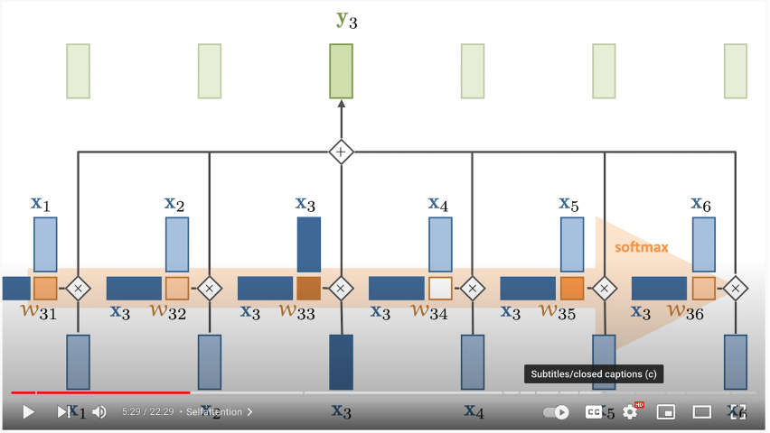
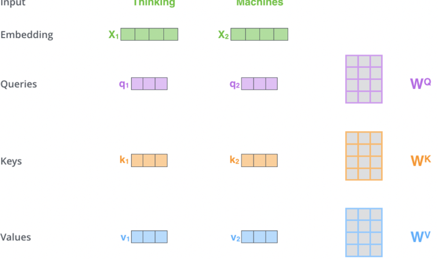
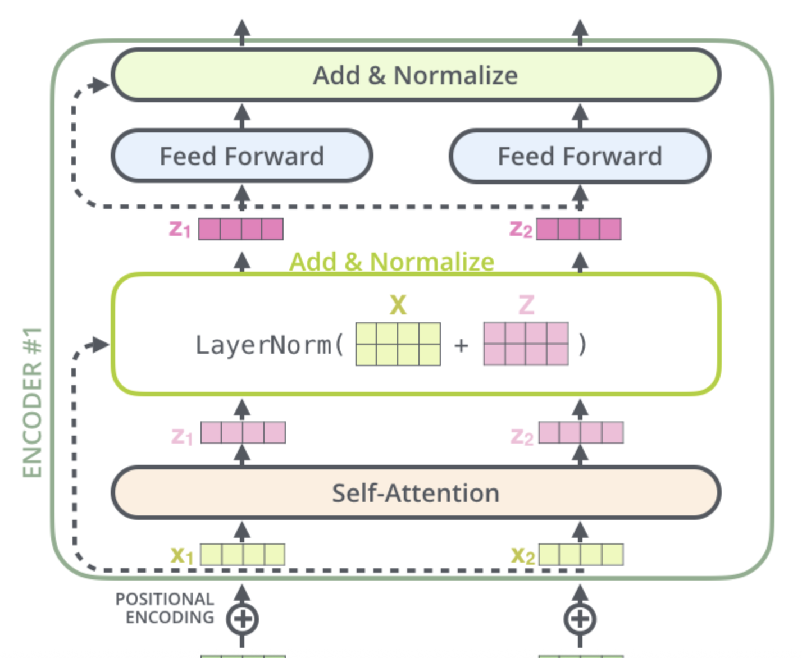
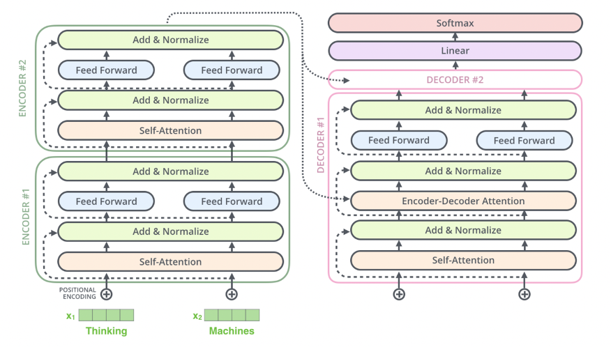

# Table of Contents
- [Attention](#attention)
  - [Self Attention](#self-attention)
    - [Example](#example)
    - [How Self Attention Works](#how-self-attention-works)
    - [Key, Query, and Value Matrices](#key-query-and-value-matrices)
    - [Multi-Head Attention](#multi-head-attention)
    - [Positional Encoding](#positional-encoding)
    - [Residual Connections and Normalization](#residual-connections-and-normalization)
    - [Summary of Self Attention](#summary-of-self-attention)
    - [Masked Self Attention](#masked-self-attention)
    - [Context Size and Scaling Challenges](#context-size-and-scaling-challenges)
  - [Encoder-Decoder Attention](#encoder-decoder-attention)
    - [How Encoder-Decoder Attention Works](#how-encoder-decoder-attention-works)
    - [Transformer Architecture for Encoder-Decoder Attention](#transformer-architecture-for-encoder-decoder-attention)
    - [Key Differences from Self Attention](#key-differences-from-self-attention)
    - [Training and Loss](#training-and-loss)
    - [Visual Representation](#visual-representation)
    - [Summary of Encoder-Decoder Attention](#summary-of-encoder-decoder-attention)

# Attention
Attention is what separates static embeddings from dynamic embeddings - they allow word embeddings to be updated, aka attended to, by the contextual words surrounding them

Attention stemmed from NLP Seq2Seq Tasks like next word prediction, and translation where using the surrounding context of the word was one of the major breakthroughs in achieving better Seq2Seq results

We need to remember that the embedding for "bank" *is always the same Embedding in the Metric Space* in these scenario's, but by attending to it with Attention, we can change it's position! It's as simple as that, so at the end of attending to the vector, the vector for bank in river bank may point in a completely different direction than the vector for bank in bank vault - just because of how the other words add or detract from it geometrically in its Metric Space. Bank + having river in sentence moves vector in matrix space closer to a sand dune, where Bank + teller in sentence moves it closer to a financial worker

How is this done? Attention mechanisms in our DNN models. There are multiple forms of Attention including Self Attention, Encoder-Decoder Attention, and Bahdanau Attention - each of them help to attend to a current query word / position based on it's surroundings. A single head of this Attention mechanism would only update certain "relationships", or attended to geometric shifts, but mutliple different Attention mechanisms might be able to learn a dynamic range of relationships

All of these Attention mechanisms are tunable matrices of weights - they are learned and updated through the model training process, and it's why we need to "bring along the model" during inference...otherwise we can't use the Attention!

## Self Attention

Self Attention allows a single sentence / document to attend to itself to update embeddings of itself. It's most commonly used when we want a sentence's word embeddings to be updated by other words in the same sentence, but there's nothing stopping us from using it over an entire document.

Self Attention is a mechanism that uses context words (**Keys**) to update the embedding of a current word (**Query**). It allows embeddings to dynamically adjust based on their surrounding context.

### Example
Consider the phrase "fluffy blue creature." The embedding for "creature" is updated by attending to "fluffy" and "blue," which contribute the most to its contextual meaning.

### How Self Attention Works
TLDR;
- The Query vector $Q_i$ is the current word
- The Key vector is an embedding representing every other word $K_j \forall  {j \neq i} $
    - We multiply the Query by every Key to find out how "similar", or "attended to" each Query should be by each Key $Q_i \cdot K_j$
- Then we softmax it to find the percentage each Key should have on the Query
- Finally we multiply that softmaxed representation by the Value vector, which is the input embedding multipled by Value matrix, and ultimately allow each Key context word to attend to our Query by some percentage

In depth mathematical explanation below

1. **Input Transformation**:
   - Each input embedding \( x_i \) is transformed into three vectors: **Query (Q)**, **Key (K)**, and **Value (V)**
   - These are computed by multiplying the input embedding with learned weight matrices:
     \[
     q_i = x_i \cdot W_Q, \quad k_i = x_i \cdot W_K, \quad v_i = x_i \cdot W_V
     \]

2. **Self-Attention Calculation**:
   - **Step 1**: Compute attention scores by taking the dot product of the Query vector \( q_i \) with all Key vectors \( k_j \):
     \[
     \text{Score}_{ij} = q_i \cdot k_j
     \]
   - **Step 2**: Scale the scores to prevent large values:
     \[
     \text{Scaled Score}_{ij} = \frac{\text{Score}_{ij}}{\sqrt{d_k}}
     \]
    - Where \( d_k \) is the dimensionality of the Key vectors
    - As the size of the input embedding grows, so does the average size of the dot product that produces the weights 
        - Remember dot product is a scalar value
        - Grows by a factor of $\sqrt{d_k}$ where k = num dimensions
        - Therefore, we can counteract this by normalizing is via $\sqrt{d_k}$ as the denominator 
   - **Step 3**: Apply softmax to convert scores into probabilities:
     \[
     \text{Attention Weight}_{ij} = \text{softmax}(\text{Scaled Score}_{ij})
     \]
   - **Step 4**: Compute the weighted sum of Value vectors:
     \[
     Z_i = \sum_j \text{Attention Weight}_{ij} \cdot V_j
     \]

3. **Output**:
   - The output \( Z_i \) is a context-aware representation of the word \( i \), influenced by its relationship with other words in the sequence.

### Key, Query, and Value Matrices

- **Query (Q)**:
  - Represents the word being attended to.
  - Used to calculate attention scores with all Keys.

- **Key (K)**:
  - Represents the context words being compared to the Query.
  - Used to compute the relevance of each context word to the Query.

- **Value (V)**:
  - Represents the actual information of the context words. It basically is a representation of each "word" so at the end, a scored `SUM()` of all words is over values!
  - Weighted by the attention scores to produce the final output.

These matrices are learned during training and updated via backpropagation.

### Multi-Head Attention
- Instead of using a single set of \( Q, K, V \), Multi-Head Attention uses multiple sets to capture different types of relationships between words (e.g., syntactic vs. semantic).
- Each head computes its own attention output.
   - Outputs from all heads are concatenated and passed through a final weight matrix \( W_O \):
     \[
     Z = \text{Concat}(O^{(head_1)}, O^{(head_2)}, \dots) \cdot W_O
     \]

### Positional Encoding

- Since Self Attention does not inherently consider word order, **Positional Encoding** is added to input embeddings to encode word positions.
- Positional encodings are vectors added to each input embedding, allowing the model to distinguish between words based on their positions in the sequence.

### Summary of Self Attention

1. **Input Transformation**:
   - Input embeddings are transformed into \( Q, K, V \) using learned weight matrices.

2. **Attention Calculation**:
   - Compute attention scores using dot products of \( Q \) and \( K \), scale them, and apply softmax.

3. **Weighted Sum**:
   - Use the attention weights to compute a weighted sum of \( V \), producing the output.

4. **Multi-Head Attention**:
   - Use multiple sets of \( Q, K, V \) to capture diverse relationships, then concatenate the results.

5. **Positional Encoding**:
   - Add positional information to embeddings to account for word order.

### Masked Self Attention
- In Masked Self Attention, it's the same process as Self Attention except we mask a certain number of words so that the \( Q \cdot K \) results in 0 effectively removing it from attention scoring
    - In BERT training we mask a number of words inside of the sentence
    - In GPT2 training we mask all future words (right hand of sentence from any word)

### Context Size and Scaling Challenges

- The size of the \( Q \cdot K \) matrix grows quadratically with the context size (\( n^2 \)), making it computationally expensive for long sequences.
- To address this, masking is used to prevent future words from influencing current words during training (e.g., in autoregressive tasks).
- Context size
    - Size of Q * K matrix at the end is the square of the context size, since we need to use all of the Q * K vectors, and…it’s a matrix! So it’s n*n = n^2 so it’s very hard to scale
    - It does help that we mask ½ the examples because we don’t want future words to alter our current word and have it cheat
        - Since for an entire sentence during training for each word we try to predict the next, so if there are 5 words there’s 1, 2, 3, 4, 5 training examples and not just 1
        - Don’t want 4 and 5 to interfere with training 1, 2, 3
 
## Encoder-Decoder Attention

Encoder-Decoder Attention is a mechanism used in **Seq2Seq tasks** (e.g., translation, summarization) to transform an input sequence into an output sequence. It combines **Self Attention** within the encoder and decoder blocks each, and then **cross-attention** between the encoder and decoder

### How Encoder-Decoder Attention Works

1. **Encoder**:
   - The encoder processes the input sequence and generates a sequence of **hidden states** that represent the context of the input
   - Each encoder block consists of:
     - **Self Attention Layer**:
       - Allows each token in the input sequence to attend to other tokens in the sequence
       - This captures relationships between tokens in the input
     - **Feed Forward Layer**:
       - Applies a fully connected feed-forward network to each token independently
       - Typically two linear transformations with a ReLU/GeLU in between: `FFN(x) = max(0, xW₁ + b₁)W₂ + b₂`
    - **Residual Connection + LayerNorm**
        - Add or normalize across vectors of the same shape
   - The output of each encoder block is passed to the next encoder block, and the final encoder block produces the **contextual embeddings** for the entire input sequence
    - This confused me at first, but basically the output of an encoder block is same dimensionality as word embedding input, so it can flow through
    - This is usually known as `d_model`
- This allows us to stack encoder blocks arbitrarily
- **Architecture**:
   - Composed of multiple identical blocks (e.g., 6 blocks by default, but this is a hyperparameter)
   - Each block contains:
     - **Self Attention Layer**: Captures relationships within the input sequence
     - **Feed Forward Layer**: Processes each token independently
    - 
    - 

2. **Decoder**:
   - The decoder generates the output sequence one token at a time, using both the encoder's output and its own previous outputs
   - Each decoder block consists of:
     - **Self Attention Layer**:
       - Allows each token in the output sequence to attend to previous tokens in the sequence (auto-regressive behavior)
       - Future tokens are masked to prevent the model from "cheating" by looking ahead
     - **Encoder-Decoder Attention Layer**:
       - Attends to the encoder's output (contextual embeddings) to incorporate information from the input sequence
       - The **Query** comes from the decoder's self-attention output, while the **Key** and **Value** come from the encoder's output
     - **Feed Forward Layer**:
       - Applies a fully connected feed-forward network to each token independently
- **Architecture**:
    - Composed of multiple identical blocks (e.g., 6 blocks by default).
    - Each block contains:
        - **Self Attention Layer**: Captures relationships within the output sequence
        - **Encoder-Decoder Attention Layer**: Incorporates information from the encoder's output
        - **Feed Forward Layer**: Processes each token independently

3. **Final Decoder Output**:
   - The final decoder layer produces a vector of floats for each token, which is passed through:
     - A **linear layer** to expand the vector to the vocabulary size
     - A **softmax layer** to produce a probability distribution over the vocabulary for the next token

#### Residual Connections and Normalization

- Each encoder layer includes a **residual connection** and **normalization layers** to stabilize training and improve gradient flow.

### Transformer Architecture for Encoder-Decoder Attention

3. **Flow of Information**:
   - The encoder processes the input sequence and generates contextual embeddings
   - The decoder uses these embeddings, along with its own self-attention, to generate the output sequence token by token

### Key Differences from Self Attention

- [**Self Attention**](#self-attention):
  - Operates within a single sequence (input or output)
  - Captures relationships between tokens in the same sequence

- **Encoder-Decoder Attention**:
  - Operates across two sequences (input and output)
  - Captures relationships between the input sequence (encoder output) and the output sequence (decoder input)

### Training and Loss

1. **Training Objective**:
   - The model is trained to predict the next token in the output sequence given the input sequence and previous tokens in the output sequence.

2. **Loss Functions**:
   - [**Cross Entropy Loss**](../other_concepts/LOSS_FUNCTIONS.md#cross-entropy):
     - Used to compare the predicted probability distribution (softmax output) with the true token.
   - [**Kullback-Leibler (KL) Divergence**](../other_concepts/LOSS_FUNCTIONS.md#kl-divergence):
     - Used to regularize the predicted probability distribution.

3. **End of Sequence**:
   - The model stops generating tokens when it outputs the `<EOS>` (end of sequence) token.

### Visual Representation

1. **Encoder Block**:
   - Self Attention → Feed Forward → Output to next encoder block.

2. **Decoder Block**:
   - Self Attention → Encoder-Decoder Attention → Feed Forward → Output to next decoder block.

3. **Final Decoder Output**:
   - The final decoder output is passed through a linear layer and softmax to produce the next token.

### Summary of Encoder-Decoder Attention

1. **Encoder**:
   - Processes the input sequence and generates contextual embeddings using self-attention.

2. **Decoder**:
   - Generates the output sequence token by token using:
     - Self Attention: Captures relationships within the output sequence.
     - Encoder-Decoder Attention: Incorporates information from the input sequence.

3. **Final Output**:
   - The decoder's output is passed through a linear layer and softmax to produce the next token.

4. **Training**:
   - The model is trained using [cross-entropy loss](../other_concepts/LOSS_FUNCTIONS.md#cross-entropy) and [KL divergence](../other_concepts/LOSS_FUNCTIONS.md#kl-divergence), with each token in the output sequence contributing to the loss.

