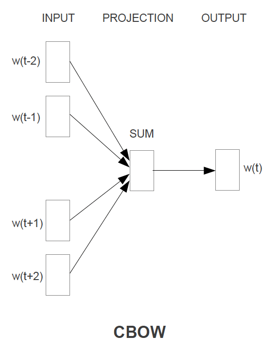
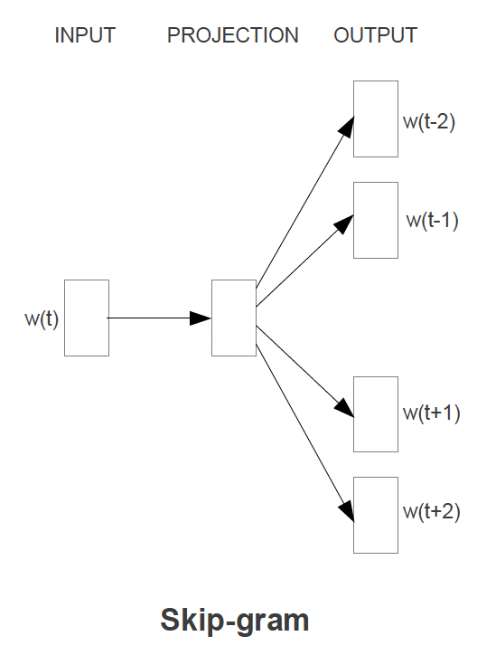
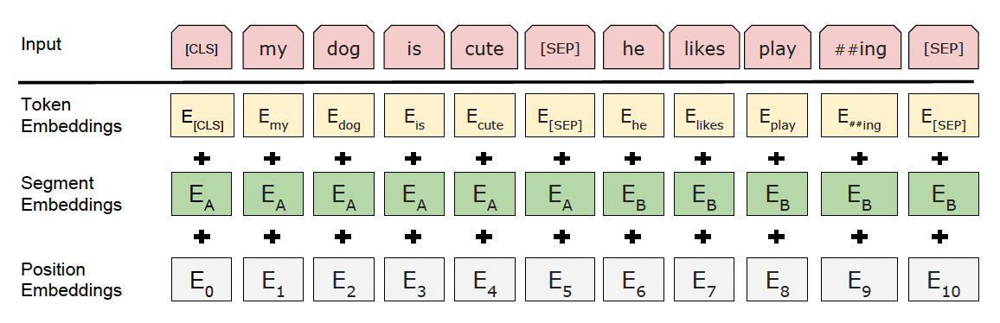
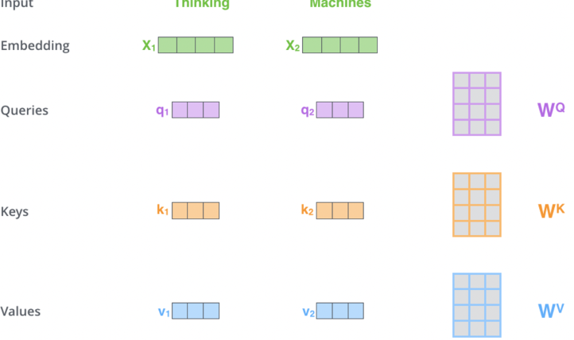
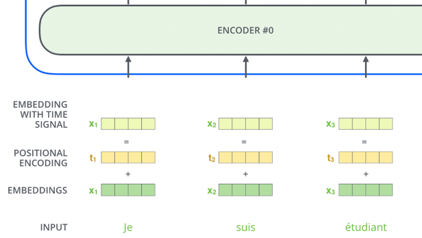
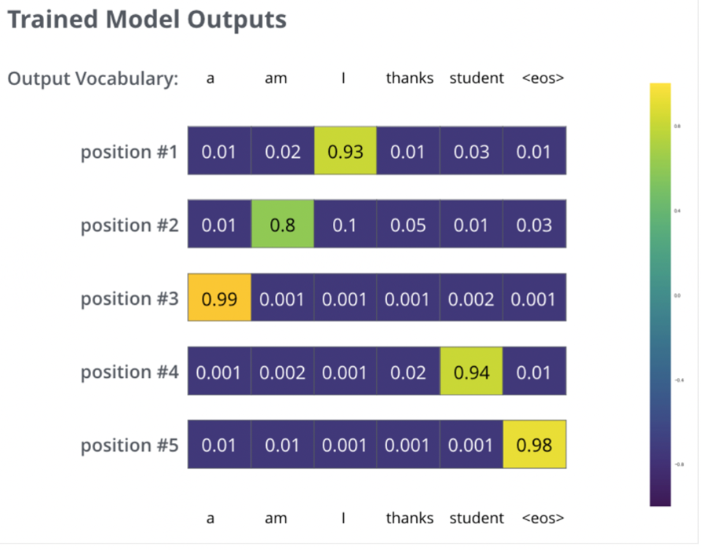

# Table of Contents
- [Embeddings](#embeddings)
  - [History](#history)
  - [Categorical Features](#categorical-features)
  - [Numeric Features](#numeric-features)
- [Text Embeddings](#text-embeddings)
  - [Word2Vec](#word2vec-1)
    - [Training and Output](#training-and-output)
    - [Model Architecture](#model-architecture)
      - [Continuous Bag of Words Architecture](#continuous-bag-of-words-architecture)
      - [Continuous Skip Gram Architecture](#continuous-skip-gram-architecture)
    - [Evaluation of Model](#evaluation-of-model)
  - [BERT](#bert)
    - [Training](#training)
      - [Base Models](#base-models)
        - [Base Model Architecture](#base-model-architecture)
        - [Masked Language Modeling Architecture](#masked-language-modeling-architecture)
        - [Next Sentence Prediction Architecture](#next-sentence-prediction-architecture)
      - [Extending Base Models](#extending-base-models)
        - [Fine Tuning Architecture](#fine-tuning-architecture)
        - [Fine Tuning Examples](#fine-tuning-examples)
    - [BERT Word Embeddings](#bert-word-embeddings)
    - [BERT Sentence Embeddings](#bert-sentence-embeddings)
- [Attention](#attention)
  - [Self Attention](#self-attention)
    - [Example](#example)
    - [How Self Attention Works](#how-self-attention-works)
    - [Key, Query, and Value Matrices](#key-query-and-value-matrices)
    - [Multi-Head Attention](#multi-head-attention)
    - [Positional Encoding](#positional-encoding)
    - [Residual Connections and Normalization](#residual-connections-and-normalization)
    - [Summary of Self Attention](#summary-of-self-attention)
    - [Context Size and Scaling Challenges](#context-size-and-scaling-challenges)
  - [Encoder-Decoder Attention](#encoder-decoder-attention)
    - [How Encoder-Decoder Attention Works](#how-encoder-decoder-attention-works)
    - [Transformer Architecture for Encoder-Decoder Attention](#transformer-architecture-for-encoder-decoder-attention)
    - [Key Differences from Self Attention](#key-differences-from-self-attention)
    - [Training and Loss](#training-and-loss)
    - [Visual Representation](#visual-representation)
    - [Summary of Encoder-Decoder Attention](#summary-of-encoder-decoder-attention)
- [User Embeddings](#user-embeddings)
- [Embeddings vs Autoencoder vs Variational Autoencoder](#embeddings-vs-autoencoder-vs-variational-autoencoder)
  - [Embeddings](#embeddings-1)
  - [Autoencoder](#autoencoder)
  - [Variational Autoencoder (VAE)](#variational-autoencoder-vae)
  - [Comparison and When to Choose](#comparison-and-when-to-choose)
- [Vector Similarities](#vector-similarities)
  - [Cosine](#cosine)
  - [Dot](#dot)
  - [Euclidean](#euclidean)

# Embeddings
Embeddings are dense vector representations of objects - typically we use them for Documents, Queries, Users, Context, or Items...but they can really be used to represent ***anything***

## History
- In the past there have been many ways of creating embeddings
- ***Encoders*** 
    - ***One Hot Encoding***: When we would replace categorical variables with vectors of sparse 0's and a single 1 representing the category
    - ***Binary Encoders***: Converts categorical variables into binary code - similar to One Hot Encoding, except we basically pick an ID that incrementally increases for new categories
- ***[Collaborative Filtering](#collaborative-filtering)*** is discussed later on
- Word2Vec
- Doc2Vec
- Node2Vec!
- etc...

## Categorical Features
- ***One-Hot Encoding*** represents orthonormal basis of vectors, and typically is useful for categorical variables but becomes infeasible if we try to use it for text features
- ***Label Encoding*** is similar to One-Hot Encoding, except we use an incremental ID for each of the categories

## Numeric Features
- This depends on the distribution of the data
    - ***Standardization***: Transforms the data to having a mean of zero, and a standard deviation of one 
        - This allows us to bring data in different distributions onto the same common scale
        - $[ z = \frac{x - \mu}{\sigma} ]$
    - ***Normalization***: Brings the data to a specific range between $[0, 1]$
        - This is helpful when you want to ensure all features contribute equally to the model
    - When to use what?
        - Standardization:
            - Use when the features have different units or scales.
            - Useful for algorithms that assume the data is normally distributed (e.g., linear regression, logistic regression, SVM).
            - Helps in dealing with outliers.  
        - Normalization:
            - Use when you want to scale the data to a specific range (e.g., [0, 1]).
            - Useful for algorithms that do not assume any specific distribution of the data (e.g., k-nearest neighbors, neural networks).
            - Ensures that all features contribute equally to the model.
- There are plenty of other ways to treat numeric data as features, but these are two easy and common ways

# Text Embeddings
Text Embeddings are one of the harder things to figure out, but there are some standards nowadays

- Training Word2Vec and BERT both involved semi self-supervised training where they take online corpus as input and basically use contextual words $w_{i-k,i+k}$ to try and create an embedding for a current word $w_i$
- [Word2Vec](#word2vec) was one of the original ideas for text embeddings - it essentially acts as an autoencoder to create ***static embeddings*** for each word in a dictionary
- [BERT](#bert) on the other hand, through [attention](#attention), can create ***contextual*** embeddings for words, sentences, and entire documents
- [GPT](#gpt-3) is an autoregressive transformer model in the same transformer "family" as [BERT](#bert), but it is ***unidirectional*** where BERT is ***bidirectional*** (which is constantly repeated in the paper)
    - GPT is good for text-to-text tasks like question answering, but like BERT we can pull from the middle hidden layers during it's self-attention steps to find word embeddings

## Word2Vec
As we said above Word2Vec is essentially a static lookup of words to embeddings, and so ***Word2Vec is an embedding model***

- Parameters:
    - $N$ is context window size (input size)
    - $V$ is the number of words in our dictionary
    - $D$ is the embedding size (projection layer)
    - $i$ is the current target word

### Training and Output
- Word2Vec will use context words to help model a current word $w_i$ - this modeling is done without context (meaning position of other words is irrelevant) and we use words in the past and future
    - When everything is finished, the weights of the shallow network are the actual embeddings themselves!
    - There are 2 types of training tasks:
        - ***Continuous Bag of Words*** where we use the context words $w_{i-N//2,i+N//2}$ as input and try to predict the current word $w_i$
            - Basically we divide context window in half in front and behind current word
        - ***Skip Gram*** is where we use the current word $w_i$ as input to predict each one of the context words $w_{i-N//2,i+N//2}$
    - This allows us to have a static embedding representation of words
- Take the final projection layer of size $V \times D$ and ***this is your word embedding matrix***

### Model Architecture
- Architecture:
    - Overall the Time Complexity will be around the order of $N \times D + D \times V$ which gets reduced to $N \times D + D \times log_2(V)$ with hierarchical softmax
        - First layer of $N \times D$ comes from taking $N$ local One-Hot Encoded Vectors, all of size $V$ and performing some calculations to get them to $N$ instances of size $D$ which is the size of our embedding
- Optimizations to training 
    - ***Negative Sampling*** where we pull a small number of negative examples along with the correct contextual examples
    - ***Sub Sampling*** is similar to Negative Sampling TODO
    - ***Hierarchical Softmax*** TODO
        - Hierarchical Softmax allows us to only use $log_2(V)$ memory and somehow time complexity in the last layer? Idrk - TODO
    - ***Huffman Tree*** is actually a further optimization of ***Hierarchical Softmax***
        - $log_2(Unigram Perplexity(V))$ which means it's even better than HSoftmax?

#### Continuous Bag of Words Architecture
- The CBOW architecture will use some surrounding context of words to predict the current word
- The context words get projected into hidden layer, and then they are basically all averaged
    - ***This means there is no context involved, and that the surrounding words are simply averaged***
- For the $N$ context words, past and future words are used
    - In the paper $N == 8$ with 4 before (historic), and 4 after (future)
- ***Training Objective:*** Predict the middle word from the $N$ surrounding context words
- ***Time Complexity:*** Would be $TC = N \times D + D \times log_2(V)$
    - General rule of thumb: Pluses separate layers, multiplication shows layer dimensions / work
- The output layer is a `log-linear classifier`
    - TODO: Explain log-linear classification
- 

#### Continuous Skip Gram Architecture
- The Skip Gram architecture will use the current word to predict some surrounding context of words
- The current word is sent through a `log-linear classifier` into a continuous projection layer, and then they projection layer is used to predict the best potential context words
    - ***This still! means there is no context involved, and that the surrounding words are simply predicted without specifying placement***
- ***Training Objective:*** Predict some $C : C \leq N$ surrounding context words from the current word, and then pick, randomly, $C$ words from the $N$ context words
    - Since more distant words *are most likely more unrelated* to the current word, we reduce computational complexity by sampling from those words less frequently
    - There's no other way to give less weight to other "far away" words other than sampling them less and updating weights less often based on them
- ***Time Complexity:*** Would be $TC = C \times D + C \times D \times log_2(V) === C \times (D + D \times log_2(V))$ 
    - For each of the $C$ words we need to take our input word $w_i$, do $D$ multiplcations to get it into projection layer, and then go from our projection layer into our sized $V$ vocabulary to try and predict $w_c$
- 

### Evaluation of Model
- In the past the main way to do this was to just show tables of words with their corresponding Top-K most similar other words, and intuitively check
- In the Word2Vec Paper they checked over relationships such as *"What is the word that is similar to small in the same sense as bigger is to big"*
    - Ideally this would produce *smaller*
- This can be done with algebraic operations! `vector(big) - vector(bigger) + vector(small)` would give us that sort of output, and then we just find the closest vector via Cosine Distance
- There are other relationships to test such as *France is to Paris as Germany is to Berlin*

TODO: Is below correct? Semantic vs Syntactic...Semantic is "underlying meaning of words" and syntactic is "placement of word"?
- ***Skip Gram performed better on semantic objectives***, which isn't surprising seeing as it's entirely focused on structuring a word to best represent what other words would be around it, so `America` and `United States` should be similar
- ***Bag of Words performed better on syntactic objectives*** showing how the CBOW model is better at syntax modeling where we could alter the sentence *The quick brown fox jumped over the lazy river* to *Over the lazy river the quick brown fox had jumped*

## BERT
BERT (Bidirectional Encoder Representations from Transformers) goes a step beyond [Word2Vec](#word2vec) as it is an all around ***language representation model*** that can provide contextual word and sentence embeddings for specific supervised tasks

***Contextual Word and Sentence Embeddings*** is a loaded phrase, but it basically means it can help encode any structure of text, for any vocabulary, and it does this through word tokenization and [attention](#attention) respectively

***Transfer Learning*** is the idea that the semi-supervised training of of a BERT model is just for creating weights and parameters, and that the ideal output of this phase is just the BERT model with said weights and parameters. Once this is done the model itself can have extra layers tacked onto it / updated and be used in a wide range of downstream tasks like sentence classification, word embeddings, report summary, etc...

BERT training has a similar setup to Word2Vec where we use a certain context size to help us model a specific word, but the embeddings can't necessarily be saved because the output layer (embedding) depdends on the hidden layers...therefore we need to pass a word through with context to get an embedding

***Bidirectionality*** is the big buzz word throughout this paper, and the paper mentioned OpenAI's GPT models multiple times discussing how they only have unidirectional architecture in the [attention](#attention) layers which ultimately restricts it's abilities in some downstream tasks like sentence classification and question answering

### Training
- BERT is designed to pre-train deep (large context) bi-directional (forwards and backwards) representations from unlabeled text by jointly conditioning on left and right context in each layer
    - This basically means that throughout the layers of BERT we use the context words to left and right of current word to update our weights
    - Difference from [Word2Vec](#word2vec) is that ***BERT keeps word positioning and context***
- Once this is complete, BERT can be ***fine-tuned*** with just one single output layer to be used as a State of The Art (SOTA) model for multiple different NLP tasks

#### Base Models
- A base model in this sense means a model that isn't necessarily trained for a specific task, but is trained to create useful parameters and weights that can be used later on
- Training a base BERT model is resource intensive, and involves:
    - ***Masked Language Modeling (MLM):*** Mask a random selection of words in the context sentence, and try to predict those (output) given the context
        - This task will fuse the left and right context windows around the word, and use both, with positional encodings, to predict the masked word
    - ***Next Sentence Prediction (NSP):*** Given positive next sentence examples, and negatively sampled incorrect next sentences, predict (output) next sentence predictions
- ***Training Objective:*** To use bi-directional language models to learn general language representations

##### Base Model Architecture
- Parameters:
    - $L$ layers / encoder blocks
    - $H$ is the size of the hidden states
    - $A$ attention heads per layer
    - $E$ represents the input embedding
    - $C \in \real^H$ represents the final hidden vector (of size $H$) of our `[CLS]` token (i.e. our "final" hidden layer for our sentence)
    - $T_i \in \real^H$ as the final hidden state for a specific input token $w_i$
    - $P_i$ is our positional encoding which represents the learned positional embedding for our token in it's specific sentence of any size
    - $S_i$ is our segment encoding which represents the learned positional embedding for our token in either segment sentence A or B
        - In our inference time examples for embeddings most people just fill it with `0's` or `1's` depending on which sentence it's apart of

- Based on bi-directional Transformer encoder architecture released in Viswani 2017, which uses [Attention](#attention) mechanisms like self-attention and Bahdanau attention to allow contextual information to flow into encoder states
- BERT uses bi-directional self-attenion, while other models like GPT use constrained left-to-right self-attention
    - Left-to-right attention means for any token / word $w_i$ it can only attent to (get attention /context from) words to the left i.e. $w_{0, i-1}$
- The input token sequence can be either a single sentence or a pair of sentences, which allows for MLM and NSP tasks mentioned above
- ***WordPiece Embeddings are used with a 30k vocab size to represent the input sequence words as numeric embeddings***
    - This is an initial part of how BERT and Word2Vec are similar
    - WordPiece is similar to Word2Vec except it will chunk out words to lower the overall space, so that words are represented like `['em', '##bed', '##ding', '##s']`
        - In this way we can reuse the embedding for the word "embeddings", which will save space over time
        - `em` in this scenario is the same as the one in "go get em" because it's at the start, but `###bed` is not equivalent to `bed` in the sentence `I went to bed`
        - Tokenizer will continuously try to split words it doesn't know, and as a worst case fallback decompose into letters
    - TODO: Check above, I think that's right but might miss some stuff about WordPiece
- There are special tokens throughout which help us to have dynamic input representations and language modeling tasks
    - `[CLS]` represents a ***special classification token*** to represent start of sentences, our final end sentences, and tokens we wish to predict
        - The final hidden state for this token represents our aggregate sequence representation for the entire sentence for classification tasks
            - It should have all of hte info of the sentence, and would be the feature input to our classification layer
    - `[SEP]` marks the separation of two sentences
        - We utilize this with a *learned embedding vector* to update embeddings whether they're in sentence A or B
            - This is just another piece of [Attention](#attention), except here the attended to portion is sentence placement, which would affect our tokens vector by updating it with sentence A or B context
- Our input representation is created by summing the token, segment, and positional embeddings - $SUM(T_i, S_i, P_i)$
    - Basically it's a representation of our token's actual word embedding, it's sentence, and it's position in the sentence
    - TODO: `[CLS]` token is just at the front - I thought this wold be at the end? Why would we use the final hidden layer of the first token?
    - Even though `[CLS]` is at the front of a sentence, it's still a useful token to use for the final hidden layer as it will contain all of the information for the rest of the sentence - since BERT is bidirectional using the start or ending word should be equivalent
- 

##### Masked Language Modeling Architecture
- ***Training Objective:*** to predict the masked word via `MAX(softmax_score)`!
- Also known as ***Cloze*** task in historic literature
- The reason bi-directional MLM is so powerful is because it allows our models to go beyond "concatenating left-to-right and right-to-left" and to actually use this inforamtion to update information
- For MLM tasks we basically need to set things up so that any word can't "see itself" and is able to use the contextual positions of all other words
- After running the sentence through for each masked word, the final hidden state is sent through an output softmax layer to predict the masked word
- 15% of words are masked in each sentence at random
- ***Catch***: The `[MASK]` token doesn't appear during downstream feature-based or fine-tuning tasks...
    - Training data generator, when coming across $w_i$ to be masked, will:
        - Replace $w_i$ with `[MASK]` 80% of the time
        - Replace $w_i$ with a random token 10% of the time
        - Do nothing the last 10% of the time
    - Finally, we can use $T_i$ to predict our actual output token, and that will be compared with $w_i$ using cross entropy loss
    - TODO: wtf do they mean above? I get if we replace the token with `[MASK]` then our BERT model will get used to that token and start to attend to other tokens with it, but if we're still doing it 80% of the time I don't get how the other 20% is strong enough to fix our model?

##### Next Sentence Prediction Architecture
- ***Training Objective:*** to predict, in a binary fashion, the next sentence from a possible next sentence that's presented to us
    - Basically we are going to give a random, possible true, next sentence B for any sentence A and predict 0 or 1 if we think it's the next sentence
- Why do we do this? Tasks like question answering and natural language inference all depend on modeling the *relationship between 2 sentences*
- Our final hidden layer for our `[CLS]` token, $C$, will be used as a feature into a final binary logistic regression output layer

#### Extending Base Models
- A "complete" model in this context is a model with a classifier that's fully trained to be used in production on a specific task
    - It most likely used a core / base model and then ran ***transfer learning*** on top of it to create a full model
    - This paradigm allows us to create magnitudes more full models that are all based on BERT base models
- The transfer learning fine tuning strategies listed below are typically *supervised* and completed on labeled data for a specific task
- There are generally 2 strategies for applying a pre-trained BERT base model to downstream tasks
    - ***Feature Based***
        - This method uses the pre-trained representations as features alongside other features
            - It might be using some user generated text as the core features alongside other user features like demographics and history
        - It boils down to creating and optimizing a new final classification layer
            - The base models weights can also be updated during training of final layer, but they don't necessarily have to be
                - This would be fine-tuning + feature based usage
            - This final classification layer is the entire basis of our downstream task, and uses the pre-trained BERT model for modeling the text representation before we finally use it
        - We could train this at base model training time, but this would involve lots of compute spend each time, or we can ***update the base models weights while training the classification layer*** 
    - ***Fine Tuning***
        - Fine Tuning models, such as ***Open AI's GPT (Generative Pre-Trained Transformer)*** models, introduce minimal task specific parameters and is trained on the downstream task by *fine-tuning all of the pre-trained models parameters*
    - The training objectives of both of these types is equivalent during pre-training, but the actual extension during transfer learning is where they diverge

##### Fine Tuning Architecture
- The architecture of our fine-tuning (or feature-based) tasks largely rely on creating a new output layer on top of our existing pre-trained models
- We can model single sentence, or sentence pairs, in our fine-tuning step, because BERT's self-attention mechanism allows for context to come through at each step
    - Encoding a concatendated text pair with self-attention will effectively include bi-directional cross-attention between 2 sentences
    - This basically means that if we concatenate two sentences together we can allow the context from sentence B to flow into sentence A because we just treat this as one single sentence, and the semgent (sentence) embedding helps us to distinguish and attend to our sentence pairings.
- For each task we simply input the input-output pairing, and use specific loss functions to ***tweak the parameters end-to-end***
- Token representations are sent into the final output layer for token level tasks
- `[CLS]` representation, $C$, is sent to the final output layer for sentence level tasks like classification or sentiment analysis

- Using a Cloud TPU or GPU we can reproduce the Fine Tuning results in an hour or a few hours respectively

##### Fine Tuning Examples
- General Language Understanding Evaluation (GLUE)
    - *Data:*
    - *Field:* Natural Language Understanding
    - *Input:* $C$, the `[CLS]` final hidden layer
    - *Parameters:* 
        - Pre-trained parameters in $H$
        - New label parameters $W \in \real^{K \times H}$ where $K$ is the number of labels
            - This effectively represents our $K$ labels in size $H$ hidden dimensions
            - These are the final output parameters for us to tune
    - *Output:* $log(softmax(CW^T))$ which represents the `log(softmax)` of our final hidden layer multiplied by our new label parameter layer
    - Ultimately this allows us to label sentences into $K$ distinct labels, where *our new classification layer is the only thing we added!*
    - On some smaller datasets things were unstable, so they would train multiple different models with random input and then randomly check-point models and choose the best one over time
        - New models after restarts would pick the best "last saved model"

- Stanford Question Answering Dataset (SQuAD)
    - *Data:* 100k crowd sourced questions and answer pairs
    - *Field:* Question Answering
    - *Input:*
        - Input the question and passage as a single, concatenated, sentence with `[SEP]` tokens
        - Question gets A segment embedding, passage gets B segement embedding
        - We need to find $[i, j]$ from our passage that answers the question
    - *Parameters:* 
        - Pre-trained parameters in $H$
        - Start and End embeddings to help us figure out when to begin and end our answer
            - Start embedding $Y \in \real^H$
            - End embedding $Z \in \real^H$
            - Probability of a word $w_i$ being the start of an answer span is $T_i \dot Y$ meaning we find the closest Token to our start embedding, and since our start embedding is learned throughout the process we basically just hope our ***start embedding, after being attended to for a specific question, represents the best starting word***
                - We also wrap the dot product in a softmax, and only calculate this over the words inside of the passage, not our entire vocab
            - Same thing for end
    - *Output:* Objective is to find $i, j : j >= i$ meaning we just want to find the right indexes in the passage that answer the question

### BERT Word Embeddings
- [Another reference link](https://mccormickml.com/2019/05/14/BERT-word-embeddings-tutorial/#history)
- Most use cases of word embeddings can come straight out of a pre-trained core BERT model
- We could send a single word through and it would most likely just be a representation of the WordPiece Embedding layer at the start
- If we send multiple words through (a sentence) then we could try and reconstruct each individual words new embedding that was altered from the self-attention layers
    - `bank` in the sentence `the large and sandy river bank` will be attended to, and ultimately different, from `the countries central bank` because it's surrounding context words are different!
    - Typically you would send through the sentence and then pull back each $T_i$, or some mixture of $H_{a, b}$ hidden states, for each $w_i$ and that would represent your finalized word embedding that was attended to / altered from contextual self-attention!
- ~[BERT Word Embeddings](./images/bert_word_embed.png)

### BERT Embeddings Pseudo Code
- We'd need to load in the WordPiece Tokenizer
- Tokenize our sentence input into Word Pieces
    - Will have some words get split into tokens like `embeddings -> [em, ###bed, ###ding, ###s]`
- Load the pre-trained BERT model
    - Set the model to `eval()` mode since we do not want to go through updating the base models weights for inference time
- Get the token ID's for each of these tokens from the pre-trained BERT state file
- Create a segement embedding (can just be repeated 0's and 1's of same size as token embeddings) which represent what sentence these tokens are apart of
    - In this scenario to embed one sentence we will most likely just have all 0's in our segment embedding
- Pass the token and segment tensors through the BERT model
- It will output all of it's hidden layers - these include multiple dimensions:
    - The layer number (13 layers)
        - Input WordPiece embedding + 12 hidden layers
    - The batch number (1 sentence)
        - Used to batch together multiple sentences for inference, for now it's just 1
    - The word / token number (22 tokens in our sentence)
    - The hidden unit / feature number (768 features)
- Most people permute this output to get it in the order of `[# tokens, # layers, # features]`
    - From this we have 13 separate vectors of size 768 for each token $w_i$
- Once this is done we can just directly `SUM`, `CONCAT`, `AVG`, etc...some mixture of hidden layers together to get our final word embedding
- TODO: Why do the hidden states represent the word embeddings? These don't get updated for our words right? If we model an entire corpus why would sending `0, 1000, 4500` through as a list of token ID's give us any sort of information? If I send through `0, 1001, 4500` are things that different even though I might be discussing a completely different word?
- TODO: What do the hidden layers of a BERT model represent? They're optimized parameters for language modeling...how does that relate to word embeddings?

Why does this work?
- The embeddings start out in the first layer with 0 contextual representation in them - `river bank` and `central bank` are the same `bank` embedding
- As the embeddings move deeper and deeper into the network they pick up more contextual information
- As you approach the final layer you start to pick up information about the pre-trained BERTs tasks, MLM and NSP respectively
- BERT is setup well to encode information, but at the end of the day BERT is meant to predict missing words or next sentences

### BERT Sentence Embeddings
- Taking the above example, the typical way to get sentence embeddings is to `SUM` or `AVG` the second to last hidden state for each token in the sentence to achieve a sentence embedding

# Attention
Attention is what separates static embeddings from dynamic embeddings - they allow word embeddings to be updated, aka attended to, by the contextual words surrounding them

Attention stemmed from NLP Seq2Seq Tasks like next word prediction, and translation where using the surrounding context of the word was one of the major breakthroughs in achieving better Seq2Seq results

We need to remember that the embedding for "bank" *is always the same Embedding in the Metric Space* in these scenario's, but by attending to it with Attention, we can change it's position! It's as simple as that, so at the end of attending to the vector, the vector for bank in river bank may point in a completely different direction than the vector for bank in bank vault - just because of how the other words add or detract from it geometrically in its Metric Space. Bank + having river in sentence moves vector in matrix space closer to a sand dune, where Bank + teller in sentence moves it closer to a financial worker

How is this done? Attention mechanisms in our DNN models. There are multiple forms of Attention including Self Attention, Encoder-Decoder Attention, and Bahdanau Attention - each of them help to attend to a current query word / position based on it's surroundings. A single head of this Attention mechanism would only update certain "relationships", or attended to geometric shifts, but mutliple different Attention mechanisms might be able to learn a dynamic range of relationships

All of these Attention mechanisms are tunable matrices of weights - they are learned and updated through the model training process, and it's why we need to "bring along the model" during inference...otherwise we can't use the Attention!

## Self Attention

Self Attention is a mechanism that uses context words (**Keys**) to update the embedding of a current word (**Query**). It allows embeddings to dynamically adjust based on their surrounding context.

### Example
Consider the phrase "fluffy blue creature." The embedding for "creature" is updated by attending to "fluffy" and "blue," which contribute the most to its contextual meaning.

### How Self Attention Works
TLDR;
- The Query vector $Q_i$ is the current word
- The Key vector is an embedding representing every other word $K_j \forall  {j \neq i} $
    - We multiply the Query by every Key to find out how "similar", or "attended to" each Query should be by each Key $Q_i \cdot K_j$
- Then we softmax it to find the percentage each Key should have on the Query
- Finally we multiply that softmaxed representation by the Value vector, which is the input embedding multipled by Value matrix, and ultimately allow each Key context word to attend to our Query by some percentage

[SelfAttention](./images/self_attention.png)

In depth mathematical explanation below

1. **Input Transformation**:
   - Each input embedding \( x_i \) is transformed into three vectors: **Query (Q)**, **Key (K)**, and **Value (V)**
   - These are computed by multiplying the input embedding with learned weight matrices:
     \[
     q_i = x_i \cdot W_Q, \quad k_i = x_i \cdot W_K, \quad v_i = x_i \cdot W_V
     \]

2. **Attention Calculation**:
   - **Step 1**: Compute attention scores by taking the dot product of the Query vector \( q_i \) with all Key vectors \( k_j \):
     \[
     \text{Score}_{ij} = q_i \cdot k_j
     \]
   - **Step 2**: Scale the scores to prevent large values:
     \[
     \text{Scaled Score}_{ij} = \frac{\text{Score}_{ij}}{\sqrt{d_k}}
     \]
    - Where \( d_k \) is the dimensionality of the Key vectors
    - As the size of the input embedding grows, so does the average size of the dot product that produces the weights 
        - Remember dot product is a scalar value
        - Grows by a factor of $\sqrt{d_k}$ where k = num dimensions
        - Therefore, we can counteract this by normalizing is via $\sqrt{d_k}$ as the denominator 
   - **Step 3**: Apply softmax to convert scores into probabilities:
     \[
     \text{Attention Weight}_{ij} = \text{softmax}(\text{Scaled Score}_{ij})
     \]
   - **Step 4**: Compute the weighted sum of Value vectors:
     \[
     Z_i = \sum_j \text{Attention Weight}_{ij} \cdot V_j
     \]

3. **Output**:
   - The output \( Z_i \) is a context-aware representation of the word \( i \), influenced by its relationship with other words in the sequence.

### Key, Query, and Value Matrices

- **Query (Q)**:
  - Represents the word being attended to.
  - Used to calculate attention scores with all Keys.

- **Key (K)**:
  - Represents the context words being compared to the Query.
  - Used to compute the relevance of each context word to the Query.

- **Value (V)**:
  - Represents the actual information of the context words.
  - Weighted by the attention scores to produce the final output.

These matrices are learned during training and updated via backpropagation.

### Multi-Head Attention

1. **Why Multi-Head Attention?**
   - Instead of using a single set of \( Q, K, V \), Multi-Head Attention uses multiple sets to capture different types of relationships between words (e.g., syntactic vs. semantic).

2. **How It Works**:
   - Each head computes its own attention output.
   - Outputs from all heads are concatenated and passed through a final weight matrix \( W_O \):
     \[
     Z = \text{Concat}(O^{(head_1)}, O^{(head_2)}, \dots) \cdot W_O
     \]

### Positional Encoding

- Since Self Attention does not inherently consider word order, **Positional Encoding** is added to input embeddings to encode word positions.
- Positional encodings are vectors added to each input embedding, allowing the model to distinguish between words based on their positions in the sequence.

### Residual Connections and Normalization

- Each encoder layer includes a **residual connection** and **normalization layers** to stabilize training and improve gradient flow.

### Summary of Self Attention

1. **Input Transformation**:
   - Input embeddings are transformed into \( Q, K, V \) using learned weight matrices.

2. **Attention Calculation**:
   - Compute attention scores using dot products of \( Q \) and \( K \), scale them, and apply softmax.

3. **Weighted Sum**:
   - Use the attention weights to compute a weighted sum of \( V \), producing the output.

4. **Multi-Head Attention**:
   - Use multiple sets of \( Q, K, V \) to capture diverse relationships, then concatenate the results.

5. **Positional Encoding**:
   - Add positional information to embeddings to account for word order.

### Context Size and Scaling Challenges

- The size of the \( Q \cdot K \) matrix grows quadratically with the context size (\( n^2 \)), making it computationally expensive for long sequences.
- To address this, masking is used to prevent future words from influencing current words during training (e.g., in autoregressive tasks).
- Context size
    - Size of Q * K matrix at the end is the square of the context size, since we need to use all of the Q * K vectors, and…it’s a matrix! So it’s n*n = n^2 so it’s very hard to scale
    - It does help that we mask ½ the examples because we don’t want future words to alter our current word and have it cheat
        - Since for an entire sentence during training for each word we try to predict the next, so if there are 5 words there’s 1, 2, 3, 4, 5 training examples and not just 1
        - Don’t want 4 and 5 to interfere with training 1, 2, 3
 
## Encoder-Decoder Attention

Encoder-Decoder Attention is a mechanism used in **Seq2Seq tasks** (e.g., translation, summarization) to transform an input sequence into an output sequence. It combines **Self Attention** within the encoder and decoder blocks with **cross-attention** between the encoder and decoder

### How Encoder-Decoder Attention Works

1. **Encoder**:
   - The encoder processes the input sequence and generates a sequence of **hidden states** that represent the context of the input
   - Each encoder block consists of:
     - **Self Attention Layer**:
       - Allows each token in the input sequence to attend to other tokens in the sequence
       - This captures relationships between tokens in the input
     - **Feed Forward Layer**:
       - Applies a fully connected feed-forward network to each token independently
   - The output of each encoder block is passed to the next encoder block, and the final encoder block produces the **contextual embeddings** for the entire input sequence

2. **Decoder**:
   - The decoder generates the output sequence one token at a time, using both the encoder's output and its own previous outputs
   - Each decoder block consists of:
     - **Self Attention Layer**:
       - Allows each token in the output sequence to attend to previous tokens in the sequence (auto-regressive behavior)
       - Future tokens are masked to prevent the model from "cheating" by looking ahead
     - **Encoder-Decoder Attention Layer**:
       - Attends to the encoder's output (contextual embeddings) to incorporate information from the input sequence
       - The **Query** comes from the decoder's self-attention output, while the **Key** and **Value** come from the encoder's output
     - **Feed Forward Layer**:
       - Applies a fully connected feed-forward network to each token independently

3. **Final Decoder Output**:
   - The final decoder layer produces a vector of floats for each token, which is passed through:
     - A **linear layer** to expand the vector to the vocabulary size
     - A **softmax layer** to produce a probability distribution over the vocabulary for the next token

### Transformer Architecture for Encoder-Decoder Attention

1. **Encoder**:
   - Composed of multiple identical blocks (e.g., 6 blocks by default, but this is a hyperparameter)
   - Each block contains:
     - **Self Attention Layer**: Captures relationships within the input sequence
     - **Feed Forward Layer**: Processes each token independently

2. **Decoder**:
   - Composed of multiple identical blocks (e.g., 6 blocks by default).
   - Each block contains:
     - **Self Attention Layer**: Captures relationships within the output sequence
     - **Encoder-Decoder Attention Layer**: Incorporates information from the encoder's output
     - **Feed Forward Layer**: Processes each token independently

3. **Flow of Information**:
   - The encoder processes the input sequence and generates contextual embeddings
   - The decoder uses these embeddings, along with its own self-attention, to generate the output sequence token by token

### Key Differences from Self Attention

- [**Self Attention**](#self-attention):
  - Operates within a single sequence (input or output)
  - Captures relationships between tokens in the same sequence

- **Encoder-Decoder Attention**:
  - Operates across two sequences (input and output)
  - Captures relationships between the input sequence (encoder output) and the output sequence (decoder input)

### Training and Loss

1. **Training Objective**:
   - The model is trained to predict the next token in the output sequence given the input sequence and previous tokens in the output sequence.

2. **Loss Functions**:
   - [**Cross Entropy Loss**](../other_concepts/LOSS_FUNCTIONS.md#cross-entropy):
     - Used to compare the predicted probability distribution (softmax output) with the true token.
   - [**Kullback-Leibler (KL) Divergence**](../other_concepts/LOSS_FUNCTIONS.md#kl-divergence):
     - Used to regularize the predicted probability distribution.

3. **End of Sequence**:
   - The model stops generating tokens when it outputs the `<EOS>` (end of sequence) token.

### Visual Representation

1. **Encoder Block**:
   - Self Attention → Feed Forward → Output to next encoder block.

2. **Decoder Block**:
   - Self Attention → Encoder-Decoder Attention → Feed Forward → Output to next decoder block.

3. **Final Decoder Output**:
   - The final decoder output is passed through a linear layer and softmax to produce the next token.

### Summary of Encoder-Decoder Attention

1. **Encoder**:
   - Processes the input sequence and generates contextual embeddings using self-attention.

2. **Decoder**:
   - Generates the output sequence token by token using:
     - Self Attention: Captures relationships within the output sequence.
     - Encoder-Decoder Attention: Incorporates information from the input sequence.

3. **Final Output**:
   - The decoder's output is passed through a linear layer and softmax to produce the next token.

4. **Training**:
   - The model is trained using [cross-entropy loss](../other_concepts/LOSS_FUNCTIONS.md#cross-entropy) and [KL divergence](../other_concepts/LOSS_FUNCTIONS.md#kl-divergence), with each token in the output sequence contributing to the loss.

# User Embeddings
TODO: Outside of collab filtering, how do we get user embeddings?
TLDR; How do we get meaningful representations of users?

# Embeddings vs Autoencoder vs Variational Autoencoder

This question has come up in my own thoughts, and others have asked me - they all get to a relatively similar output of representing things into a compressed numeric format, but they all have different training objectives, use cases, and architectures - Autoencoders were created to reduce dimensionality, and Embeddings were created to represent, possibly dense items, into dense numeric representations

## Embeddings
### Description
- Embeddings are dense vector representations of objects (e.g., words, users, items) that capture their semantic or contextual meaning in a continuous vector space
- They are typically learned during the training of a neural network and can be static (pre-trained) or dynamic (contextual)

### Use Cases
- **Static Embeddings**:
  - Pre-trained embeddings like Word2Vec or GloVe are used for tasks where the context does not change (e.g., word similarity tasks)
  - Example: Representing the word "bank" as a fixed vector regardless of its context
- **Dynamic Embeddings**:
  - Contextual embeddings like BERT or GPT are used for tasks where the meaning of the object depends on its context
  - Example: Representing "bank" differently in "river bank" vs. "central bank."

### When to Use
- Use embeddings when you need a lightweight, efficient representation of objects for tasks like:
  - Search and retrieval (e.g., cosine similarity between query and document embeddings)
  - Recommendation systems (e.g., user-item embeddings)
  - Pre-trained embeddings for transfer learning

## Autoencoder
### Description
- An Autoencoder is a type of neural network designed for dimensionality reduction. It learns to encode input data into a compressed representation (embedding) in the hidden layer and then reconstructs the original input from this representation
    - It's typically used to represent sparse data into a more compact format
- The encoder compresses the input, and the decoder reconstructs it
- So what's the difference between an Autoencoder and Word2Vec? 
    - Word2Vec doesn't get train input word to be reconstructed on the other side (outright) like an Autoencoder, instead it tries to predict surrounding words...therefore the end results are ultimately the same, but the training tasks are different

### Use Cases
- **Dimensionality Reduction**:
  - Reducing high-dimensional data into a lower-dimensional embedding while preserving important features
  - Example: Compressing image data for visualization or clustering
- **Static Embeddings**:
  - The hidden layer of the Autoencoder can be used as a static embedding for the input data
  - Example: Representing user profiles or item features in a recommendation system

### When to Use
- Use Autoencoders when:
  - You need ***static embeddings*** for structured data (e.g., tabular data, images)
  - The input and output are the same, and you want to reduce dimensionality
  - You do not need to generate new data points but only want a dense representation of existing data

## Variational Autoencoder (VAE)
### Description
- A Variational Autoencoder is an extension of the Autoencoder that introduces a probabilistic approach. Instead of encoding the input into a single deterministic vector, it encodes it into a distribution (mean and variance)
- The decoder samples from this distribution to reconstruct the input, allowing the generation of new data points

### Use Cases
- **Generative Models**:
  - VAEs are used to generate new data points similar to the training data
  - Example: Generating new images, text, or user profiles
- **Dynamic Embeddings**:
  - The latent space of the VAE can be used to create embeddings that capture uncertainty or variability in the data
  - Example: Representing user preferences with variability for personalized recommendations

### When to Use
- Use VAEs when:
  - You need to generate new data points (e.g., synthetic data generation, data augmentation)
  - You want embeddings that capture uncertainty or variability in the data
  - The task involves probabilistic modeling (e.g., anomaly detection, generative tasks)

## Comparison and When to Choose

| **Technique**         | **Static Embeddings** | **Dynamic Embeddings** | **Generative Tasks** | **Dimensionality Reduction** |
|------------------------|-----------------------|-------------------------|-----------------------|------------------------------|
| **Embeddings**         | Yes                  | Yes                    | No                    | No                           |
| **Autoencoder**        | Yes                  | No                     | No                    | Yes                          |
| **Variational Autoencoder (VAE)** | No                  | Yes                    | Yes                   | Yes                          |
| **Word2Vec**           | Yes                  | No                     | No                    | No                           |

### Key Considerations
1. **Static vs. Dynamic Embeddings**:
   - Use Autoencoders or Word2Vec for static representations
   - Use BERT or some sort of Transformer model with Attention for dynamic embeddings

2. **Dimensionality Reduction**:
   - Use Autoencoders or VAEs when you need to reduce the dimensionality of high-dimensional data

3. **Generative Tasks**:
   - Use VAEs when you need to generate new data points or capture variability in the data

4. **Lightweight Models**:
   - Use Word2Vec for lightweight, static word embeddings

# Vector Similarities
Vector similarities are useful for comparing our final embeddings to others in search space

## Cosine
Cosine similarity will ultimately find the angle between 2 vectors
$\text{cosine similarity}(A, B) = \frac{A \cdot B}{|A| |B|}$

- Where
    - $( A \cdot B )$ is the dot product of vectors $( A )$ and $( B )$.
    - $( |A| )$ and $( |B| )$ are the magnitudes (or Euclidean norms) of vectors $( A )$ and $( B )$
        - Therefore, magnitude has no effect on our measurement, and we only check angle between vectors
- Cosine similarity ranges from $[-1, 1]$ where:
    - 1 indicates they're overlapping and pointing in the exact same direction
    - 0 indicates they're fully orthonormal (right angle) with 0 overlap over any dimensions
    - -1 indicates they're pointing in exactly opposite directions

## Dot
The Dot product is similar to the Cosine product, except it doens't ignore the magnitude

$dot(a, b) = \sum_{i=1}^v a_ib_i = {|A| |B|}cosine(a,b)$ 

Which basically means we just compare each item over each dimension. If $a, b$ are normalized then Dot is equivalent to Cosine

## Euclidean
This is the typical distance in euclidean space

$euclidean(a, b) = [\sum_{i=1}^v (a_i \times b_i)^2]^{1/2}$ 

Here magnitude matters, and a smaller distance between vector end-points means a smaller overall distance metric
