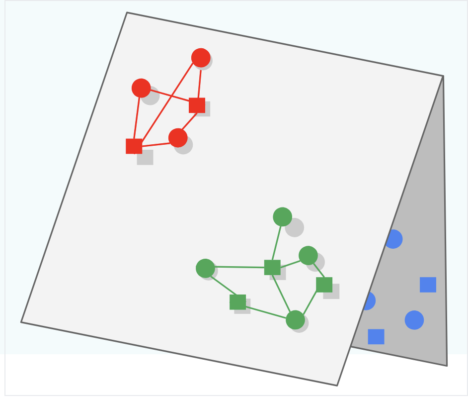

# Output Layers
The final output layers of our models typically go hand-in-hand with the [Loss Functions](#loss-functions) that we use

## Catches 
Some gotchas apart of model training and loss functions

### Folding
If we only focus on the "positive" examples during training, and we don't introduce negatives for the model to "learn" / iterate over, then our model could be prone to Folding

Folding is what occurs when embeddings of different items end up close to each other in the metric space, even though they may be unrelated. When this occurs the embedding representations "look close" to each other, but in reality they should be separated. 

In the picture below the Green and Blue subspaces should be learned to be separated (i.e. create triangle 3d structure) instead of keeping them both on the 2d plane and overlapping, which would lead to Green being served for Blue queries and vice versa

## Regression
Regression output layers are used when the task is to predict continuous values

### Linear
- **Usage**: Regression
- **Description**: The linear output layer outputs a continuous value. It is used for regression tasks where the goal is to predict a continuous variable
- **Formula**: $[ y = w \cdot x + b ]$
- Where:
    - $( y )$ is the predicted output
    - $( w )$ is the weight matrix
    - $( x )$ is the input vector
    - $( b )$ is the bias term
    
## Classification
Classification output layers are used when the task is to predict discrete labels or categories

Why do we use these output formulas? We want them to be "nice" for derivates and not to have vanishing gradients. They're also fairly intuitive for each of the specific tasks they're used for.

### Sigmoid
- **Usage**: Binary classification
- **Description**: The sigmoid function outputs a probability value between 0 and 1 for each class. It is typically used for binary classification tasks
- **Formula**: $\sigma(x) = \frac{1}{1 + e^{-x}}$

### Softmax
- **Usage**: Multi-class classification
- **Description**: The softmax function outputs a probability distribution over multiple classes. It is used for multi-class classification tasks
- **Formula**: $\text{softmax}(x_i) = \frac{e^{x_i}}{\sum_{j} e^{x_j}}$

## Other Types

### Softmax with Temperature
- **Usage**: Multi-class classification with control over the confidence of predictions
- **Description**: The softmax with temperature function introduces a temperature parameter to control the confidence of the predictions. Lower temperatures make the model more confident, while higher temperatures make it less confident
- **Formula**: \(\text{softmax}(x_i, T) = \frac{e^{x_i / T}}{\sum_{j} e^{x_j / T}}\)

### Logits
- **Usage**: Intermediate representation for classification
- **Description**: Logits are the raw, unnormalized scores output by the model before applying a softmax or sigmoid function. They are often used as an intermediate representation in classification tasks

### Tanh
- **Usage**: Regression or binary classification
- **Description**: The tanh function outputs values between -1 and 1. It can be used for regression tasks or binary classification tasks where the output needs to be in this range
- **Formula**: \(\tanh(x) = \frac{e^x - e^{-x}}{e^x + e^{-x}}\)

# Loss Functions
Loss functions are the entire heart of model training and tuning 

## Gradient Descent
Gradient Descent is the main algorithm for updating weights based on our loss functions - it will basically chain together a bunch of partial derivatives which show each parameters effects on the output, and based on the output's loss the weights will be updated in the negative direction

It's simply a way to move parameters towards places that create "good" layers to create the final output layer as close as possible to what we're trying to model

Gradient Descent will run over all training examples

## Negative Sampling
To combat [Folding](#folding) we know we must use negative samples, but instead of using every single negative example we should pick a sample of negatives! In this way we can randomly choose "bad" examples and feed them through as 0's.

### Stochastic Gradient Descent (SGD)
Stochastic Gradient Descent updates the model parameters using a single training example at each iteration. This introduces noise into the optimization process, which can help escape local minima.

### Mini Batch
Mini Batch Gradient Descent updates the model parameters using a small batch of training examples at each iteration. This balances the efficiency of batch gradient descent with the noise reduction of stochastic gradient descent.

### Mini Batch Stochastic Gradient Descent
Mini Batch Stochastic Gradient Descent combines the concepts of mini batch and stochastic gradient descent. It updates the model parameters using a small, randomly selected batch of training examples at each iteration.

## Weighted Alternating Least Squares
Weighted Alternating Least Squares is an optimization algorithm used in matrix factorization techniques, particularly for recommendation systems. It alternates between fixing the user matrix and optimizing the item matrix, and vice versa, while incorporating weights for observed and unobserved interactions.

## Cross Entropy
Cross Entropy is a loss function commonly used for classification tasks. It measures the difference between the true probability distribution and the predicted probability distribution

